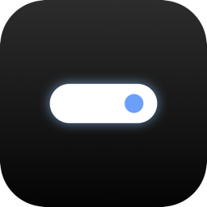
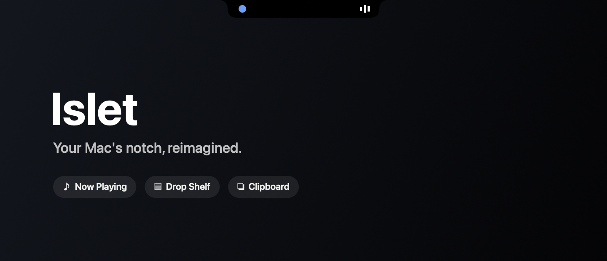

<div align="center">



# Islet

**Turn your Mac's notch into a live hub for media, files, and your clipboard.**

[](https://github.com/OWNER/islet/actions/workflows/ci.yml)
[](https://github.com/OWNER/islet/releases)




</div>

> **Beta software.** Islet is an independent, open-source project inspired by notch utilities
> like NotchNook. It is not affiliated with or endorsed by them.

---

## Features

Hover the notch and it expands into a real **Liquid Glass** panel with three tabs.

### 🎵 Now Playing
- **System-wide** detection — Apple Music, Spotify, and web audio playing in a browser
  tab (Safari, Chrome, anything using the Media Session API), via the same feed that
  powers Control Center's Now Playing widget.
- Real embedded album/cover art, title, artist, and source app, with
  **play / pause / next / previous** controls.
- When collapsed, the notch peeks the album art and a live audio-bars indicator.

### 🗂 Drop Shelf
- Drag any file onto the notch to stash it on a temporary shelf.
- Drag files back out into Finder, Mail, Slack — anywhere that accepts a drop.
- Double-click to reveal in Finder; the shelf persists between launches.

### 📋 Clipboard History
- Keeps a rolling history of copied **text and images**.
- Click any entry to copy it back to the pasteboard.
- Skips passwords and transient copies from password managers (configurable).

### ✨ Live activities
A subtle, brief widening of the collapsed pill — not a full expand — hints at background
events: a track starting, a file landing on the shelf, something new on the clipboard.
Never fires while you're already looking at the notch.

### 🧊 Liquid Glass throughout
The expanded panel is rendered with AppKit's native `NSGlassEffectView` (macOS 26's real
glass material), buttons use the system `.glass` button style, and Settings has a
custom glass slider — not an imitation blur.

### ⚙️ Settings
A full preferences window covering:
- **Notch behavior** — expand on hover or click, open/close delays, haptics.
- **Size & shape** — expanded width/height, corner radius, collapsed height boost.
- **Displays** — built-in only, primary only, or all screens (works on notchless Macs too, as a floating handle).
- **Features** — toggle each feature independently.
- **Clipboard** — history size, image storage, password filtering.
- Launch at login.

---

## Install

### Download (recommended)
1. Grab `Islet.app.zip` from the [latest release](https://github.com/OWNER/islet/releases).
2. Unzip and move **Islet.app** to `/Applications`.
3. Because the beta is **ad-hoc signed (not notarized)**, right-click the app → **Open** the
   first time, or run:
   ```bash
   xattr -dr com.apple.quarantine /Applications/Islet.app
   ```
4. No further setup — no permissions to grant for Now Playing.

### Build from source
Requires macOS 26 (Tahoe) or later, and either Xcode or the Swift toolchain (Command Line Tools are enough).
```bash
git clone https://github.com/OWNER/islet.git
cd islet
./scripts/build_app.sh release
open build/Islet.app
```

---

## Permissions

Now Playing needs no permission prompt — it reads the system's Now Playing feed the same
way Control Center does. No Accessibility or Automation access is required.

> **Note on private APIs.** Now Playing detection uses `MediaRemote.framework`, and the
> expanded panel uses `NSGlassEffectView` — both are real system frameworks, loaded and
> called normally, but `MediaRemote` is undocumented (not part of the public SDK). It's
> the same mechanism many popular menu-bar Now Playing widgets rely on, and it degrades
> gracefully (Now Playing just shows nothing) if a future macOS update changes it. See
> [docs/ARCHITECTURE.md](docs/ARCHITECTURE.md) for details.

---

## Development

```bash
swift build              # build everything
swift run IsletChecks    # run the built-in self-checks (no Xcode needed)
swift test               # run the swift-testing suite (requires Xcode)
./scripts/build_app.sh   # assemble Islet.app
```

The project is a Swift Package:

- **`IsletCore`** — all app logic (notch window, features, settings, view models).
- **`Islet`** — the thin `NSApplication` executable.
- **`IsletChecks`** — a dependency-free assertion runner (Command Line Tools ship no XCTest).
- **`IsletTests`** — the swift-testing suite used in CI.

See [docs/ARCHITECTURE.md](docs/ARCHITECTURE.md) for a tour of the code.

---

## Roadmap

- [ ] Notarized, Developer ID-signed builds
- [ ] Drag-to-open while a Finder drag is in progress
- [ ] Scrubbable playback progress + volume
- [ ] Calendar / timer / battery widgets
- [ ] Custom accent colors and themes

Known beta limitations are tracked in [CHANGELOG.md](CHANGELOG.md).

---

## Contributing

Issues and PRs welcome — see [CONTRIBUTING.md](CONTRIBUTING.md).

## License

[MIT](LICENSE) © Islet contributors.
